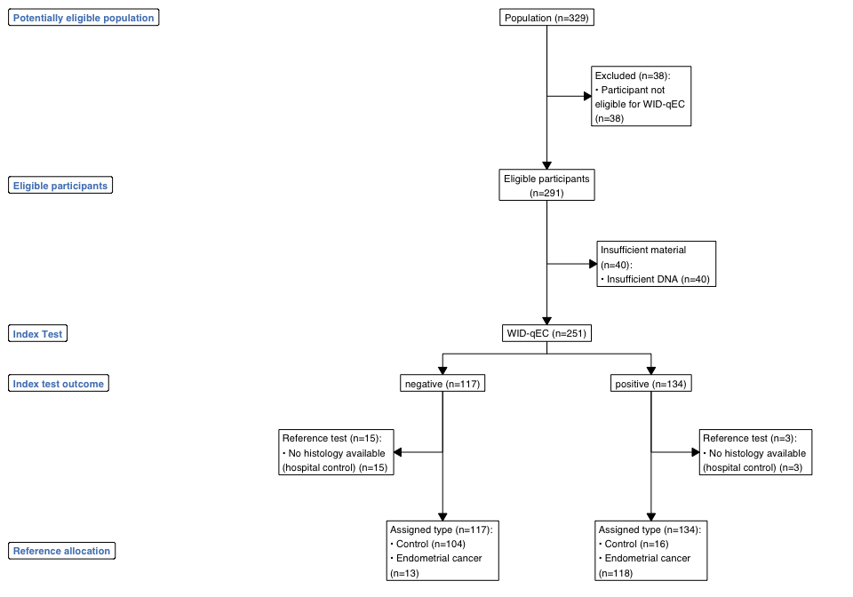
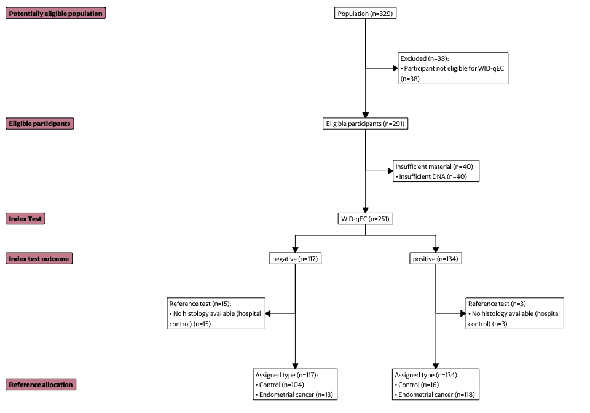
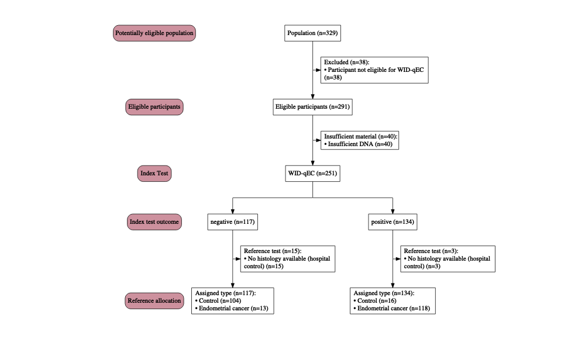

<!-- README.md is generated from README.Rmd. Please edit that file -->

# stard

The goal of `stard` is to make it easy to create
[STARD](https://www.equator-network.org/reporting-guidelines/stard/)
diagrams for the transparent reporting of diagnostic accuracy studies.
The stard package is built upon and extends the
[consort](https://github.com/adayim/consort/) package. Diagrams are
created by a stardardized data frame and use these data as the source
for creation of the diagram. Manual labels can be supplied, but this is
in development version.

## Installation

You can install the beta version of `stard` from
[GitHub](https://github.com/) with:

``` r
# install.packages("devtools")
devtools::install_github("chiaraherzog/stard")
```

## Example

This is a basic example which shows you how to create a STARD diagram
using data from a [code
repository](https://github.com/chiaraherzog/WID-qEC-source-code) of of a
previous publication ([Herzog et al., 2023,
JCO](https://ascopubs.org/doi/10.1200/JCO.22.00266)).

``` r
library(stard)
## basic example code
```

``` r
library(dplyr)
```

    ## 
    ## Attaching package: 'dplyr'

    ## The following objects are masked from 'package:stats':
    ## 
    ##     filter, lag

    ## The following objects are masked from 'package:base':
    ## 
    ##     intersect, setdiff, setequal, union

``` r
# Load data
mldat <- stard::mldat

# Filter Barcelona Validation Set
data <- mldat |> 
  dplyr::filter(set == 'Barcelona Validation')

# Excluded participants with insufficient DNA were not included
# in the final dataframe, so rows are added here
excl <- data.frame(excluded = rep("Participant not eligible for WID-qEC", 38))
insufficient <- data.frame(insufficient = rep("Insufficient DNA", 40))
data$excluded <- NA
data$insufficient <- NA
data <- plyr::rbind.fill(data,
                         excl, insufficient)

# Assign a unique pseudo-ID
data$id = 1:nrow(data)

# Assign a threshold and whether a histology was available
data <- data |> 
  dplyr::mutate(
    qEC = ifelse(sum > 0.03, "positive", "negative"),
    histology_available = case_when(controldiag == 'Hospital control' &
                                      type == 'Control' ~
                                      "No histology available (hospital control)",
                                    TRUE ~ NA))

# Additional text for formatting
data <- data |> 
  dplyr::mutate(excltext = ifelse(is.na(excluded), "Not eligible", NA),
                insufficienttext = ifelse(is.na(insufficient), "Not sufficient", NA))

data <- data |> 
  dplyr::select(id, excluded, excltext, insufficient, qEC, histology_available, type)

head(data)
```

    ##   id excluded     excltext insufficient      qEC histology_available
    ## 1  1     <NA> Not eligible         <NA> positive                <NA>
    ## 2  2     <NA> Not eligible         <NA> positive                <NA>
    ## 3  3     <NA> Not eligible         <NA> negative                <NA>
    ## 4  4     <NA> Not eligible         <NA> positive                <NA>
    ## 5  5     <NA> Not eligible         <NA> negative                <NA>
    ## 6  6     <NA> Not eligible         <NA> negative                <NA>
    ##                 type
    ## 1 Endometrial cancer
    ## 2            Control
    ## 3            Control
    ## 4            Control
    ## 5            Control
    ## 6            Control

``` r
out <- stard_plot(data = data,
                  order = c(id ="Population",
                            excluded = "Eligible participants",
                            excltext  = "Eligible participants",
                            insufficient = "Included participants",
                            qEC = "WID-qEC",
                            histology_available = 'No histology',
                            id = 'number',
                            type = "Assigned type"),
                  side_box = c("excluded",
                               "insufficient"),
                  side_note = 'histology_available',
                  index_test = "qEC",
                  type = 'type',
                  labels = c("1" = "Potentially eligible population",
                             "2" = "Eligible participants",
                             "3" = 'Index Test',
                             "4" = "Index test outcome",
                             "5" = "Reference allocation"),
                  cex = 0.8)


plot(out)
```

<!-- -->

We can also modulate label colours, font, and text width:

``` r
out <- stard_plot(data = data,
                  order = c(id ="Population",
                            excluded = "Eligible participants",
                            excltext  = "Eligible participants",
                            insufficient = "Included participants",
                            qEC = "WID-qEC",
                            histology_available = 'No histology',
                            id = 'number',
                            type = "Assigned type"),
                  side_box = c("excluded",
                               "insufficient"),
                  side_note = 'histology_available',
                  index_test = "qEC",
                  type = 'type',
                  labels = c("1" = "Potentially eligible population",
                             "2" = "Eligible participants",
                             "3" = 'Index Test',
                             "4" = "Index test outcome",
                             "5" = "Reference allocation"),
                  cex = 0.8,
                  fontfam = 'Guardian Sans',
                  col = 'white',
                  fill = 'black',
                  text_width = 40)

plot(out)
```

<!-- -->

The plot can be saved as follows:

``` r
png("stard_diagram.png", width = 29, 
    height = 21, res = 300, units = "cm", type = "cairo") 
plot(out)
dev.off() 
```

    ## quartz_off_screen 
    ##                 2

``` r
cairo_pdf("stard_diagram.pdf", width = 10, 
    height = 7) 
plot(out)
```

## Side note

The side_note parameter can be used to add a side note whereby the data
thereafter are not filtered by the NAs in that variable. This can be
helpful for additional information where subsetting is not desired.

## Graphviz

As in the `consort` diagram, a `Graphviz` plot can be produced by
setting `grViz = TRUE` in `plot`. This will use `DiagrammeR` to print
the plot and is ideal for Shiny or HTML output. However, this might not
necessarily work with custom formatting yet.

``` r
plot(out, grViz = TRUE)
```

<!-- -->

Or save this `Graphviz` plot to `png` or `pdf`

``` r
plot(g, grViz = TRUE) |> 
    DiagrammeRsvg::export_svg() |> 
    charToRaw() |> 
    rsvg::rsvg_pdf("svg_graph.pdf")
```
